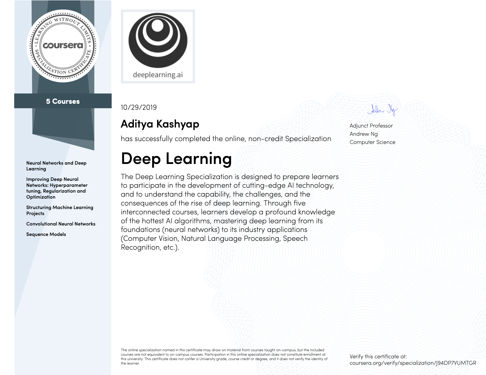

# DeepLearning.ai Courses Notes
[DeepLearning.ai](https://deeplearning.ai)  contains five courses which can be taken on [Coursera](https://www.coursera.org/specializations/deep-learning). The five courses titles are:

1. Neural Networks and Deep Learning.
2. Improving Deep Neural Networks: Hyperparameter tuning, Regularization and Optimization.
3. Structuring Machine Learning Projects.
4. Convolutional Neural Networks.
5. Sequence Models.

## Specialization Certificate

I've successfully completed the specialization and earned my [certificate](https://www.coursera.org/account/accomplishments/specialization/certificate/J94DP7VUMTGR)!

# Headers for the entire specialization
Below, I have consolidated the contents for every week of every course to help during revision.

# Credits
I have built upon [Mahmoud Badry's](https://github.com/mbadry1/DeepLearning.ai-Summary) and [Pradeep Kumar Pant's](https://github.com/ppant/deeplearning.ai-notes) notes

# Course 1: Neural Networks and Deep Learning

## Table of contents
 * [Week 1: Introduction to deep learning](#introduction-to-deep-learning)
    * [What is a (Neural Network) NN?](#what-is-a-neural-network-nn)
    * [Supervised learning with neural networks](#supervised-learning-with-neural-networks)
    * [Why is deep learning taking off?](#why-is-deep-learning-taking-off)
    * Quiz
    * Interview: Geoffrey Hinton
 * [Week 2: Neural Networks Basics](#neural-networks-basics)
    * [Binary classification](#binary-classification)
    * [Logistic regression](#logistic-regression)
    * [Logistic regression cost function](#logistic-regression-cost-function)
    * [Gradient Descent](#gradient-descent)
    * [Derivatives](#derivatives)
    * [More Derivatives examples](#more-derivatives-examples)
    * [Computation graph](#computation-graph)
    * [Derivatives with a Computation Graph](#derivatives-with-a-computation-graph)
    * [Logistic Regression Gradient Descent](#logistic-regression-gradient-descent)
    * [Gradient Descent on m Examples](#gradient-descent-on-m-examples)
    * [Vectorization](#vectorization)
    * [Vectorizing Logistic Regression](#vectorizing-logistic-regression)
    * [Notes on Python and NumPy](#notes-on-python-and-numpy)
    * [General Notes](#general-notes)
    * Quiz
    * Assignment (Optional): Python Basics with NumPy
    * Assignment: Logistic Regression with a Neural Network Mindset
      - Cat classifier using logistic regression in such a way as to build intuition relevant to neural networks
    * Interview: Pieter Abbeel
 * [Week 3: Shallow neural networks](#shallow-neural-networks)
    * [Neural Networks Overview](#neural-networks-overview)
    * [Neural Network Representation](#neural-network-representation)
    * [Computing a Neural Network's Output](#computing-a-neural-networks-output)
    * [Vectorizing across multiple examples](#vectorizing-across-multiple-examples)
    * [Activation functions](#activation-functions)
    * [Why do you need non-linear activation functions?](#why-do-you-need-non-linear-activation-functions)
    * [Derivatives of activation functions](#derivatives-of-activation-functions)
    * [Gradient descent for Neural Networks](#gradient-descent-for-neural-networks)
    * [Random Initialization](#random-initialization)
    * Quiz
    * Assignment: Planar Data Classification with a hidden layer
    * [Interview: Ian Goodfellow](#extra-ian-goodfellow-interview)
 * [Week 4: Deep Neural Networks](#deep-neural-networks)
    * [Deep L-layer neural network](#deep-l-layer-neural-network)
    * [Forward Propagation in a Deep Network](#forward-propagation-in-a-deep-network)
    * [Getting your matrix dimensions right](#getting-your-matrix-dimensions-right)
    * [Why deep representations?](#why-deep-representations)
    * [Building blocks of deep neural networks](#building-blocks-of-deep-neural-networks)
    * [Forward and Backward Propagation](#forward-and-backward-propagation)
    * [Parameters vs Hyperparameters](#parameters-vs-hyperparameters)
    * [What does this have to do with the brain](#what-does-this-have-to-do-with-the-brain)
    * Quiz
    * Assignment: Building a deep neural network to classify cat vs non-cat images

# Course 2: Improving Deep Neural Networks: Hyperparameter tuning, Regularization and Optimization
## Table of contents
  * [Week 1: Practical aspects of Deep Learning](#practical-aspects-of-deep-learning)
    * [Train / Dev / Test sets](#train--dev--test-sets)
    * [Bias / Variance](#bias--variance)
    * [Basic Recipe for Machine Learning](#basic-recipe-for-machine-learning)
    * [Regularization](#regularization)
    * [Why regularization reduces overfitting?](#why-regularization-reduces-overfitting)
    * [Dropout Regularization](#dropout-regularization)
    * [Understanding Dropout](#understanding-dropout)
    * [Other regularization methods](#other-regularization-methods)
    * [Normalizing inputs](#normalizing-inputs)
    * [Vanishing / Exploding gradients](#vanishing--exploding-gradients)
    * [Weight Initialization for Deep Networks](#weight-initialization-for-deep-networks)
    * [Numerical approximation of gradients](#numerical-approximation-of-gradients)
    * [Gradient checking implementation notes](#gradient-checking-implementation-notes)
    * [Initialization summary](#initialization-summary)
    * [Regularization summary](#regularization-summary)
    * Quiz
    * Assignments: Initialization, Regularization, Gradient Checking
    * Interview: Yoshua Bengio
  * [Week 2: Optimization algorithms](#optimization-algorithms)
    * [Mini-batch gradient descent](#mini-batch-gradient-descent)
    * [Understanding mini-batch gradient descent](#understanding-mini-batch-gradient-descent)
    * [Exponentially weighted averages](#exponentially-weighted-averages)
    * [Understanding exponentially weighted averages](#understanding-exponentially-weighted-averages)
    * [Bias correction in exponentially weighted averages](#bias-correction-in-exponentially-weighted-averages)
    * [Gradient descent with momentum](#gradient-descent-with-momentum)
    * [RMSprop](#rmsprop)
    * [Adam optimization algorithm](#adam-optimization-algorithm)
    * [Learning rate decay](#learning-rate-decay)
    * [The problem of local optima](#the-problem-of-local-optima)
    * Quiz
    * Assignments: Optimization
    * Interview: Yuanqing Lin
  * [Week 3: Hyperparameter tuning, Batch Normalization and Programming Frameworks](#hyperparameter-tuning-batch-normalization-and-programming-frameworks)
    * [Tuning process](#tuning-process)
    * [Using an appropriate scale to pick hyperparameters](#using-an-appropriate-scale-to-pick-hyperparameters)
    * [Hyperparameters tuning in practice: Pandas vs. Caviar](#hyperparameters-tuning-in-practice-pandas-vs-caviar)
    * [Normalizing activations in a network](#normalizing-activations-in-a-network)
    * [Fitting Batch Normalization into a neural network](#fitting-batch-normalization-into-a-neural-network)
    * [Why does Batch normalization work?](#why-does-batch-normalization-work)
    * [Batch normalization at test time](#batch-normalization-at-test-time)
    * [Softmax Regression](#softmax-regression)
    * [Training a Softmax classifier](#training-a-softmax-classifier)
    * [Deep learning frameworks](#deep-learning-frameworks)
    * [TensorFlow](#tensorflow)
    * Quiz
    * Assignment: TensorFlow introduction. Build a Deep NN to recognize numbers 0-5 in sign language
  * [Extra Notes](#extra-notes)

# Course 3: Structuring Machine Learning Projects
## Table of contents
  * [Week 1: ML Strategy 1](#ml-strategy-1)
    * [Why ML Strategy](#why-ml-strategy)
    * [Orthogonalization](#orthogonalization)
    * [Single number evaluation metric](#single-number-evaluation-metric)
    * [Satisfying and Optimizing metric](#satisfying-and-optimizing-metric)
    * [Train/dev/test distributions](#traindevtest-distributions)
    * [Size of the dev and test sets](#size-of-the-dev-and-test-sets)
    * [When to change dev/test sets and metrics](#when-to-change-devtest-sets-and-metrics)
    * [Why human-level performance?](#why-human-level-performance)
    * [Avoidable bias](#avoidable-bias)
    * [Understanding human-level performance](#understanding-human-level-performance)
    * [Surpassing human-level performance](#surpassing-human-level-performance)
    * [Improving your model performance](#improving-your-model-performance)
    * Quiz (45 min case study): Bird Recognition
    * Interview: Andrej Karpathy
  * [Week 2: ML Strategy 2](#ml-strategy-2)
    * [Carrying out error analysis](#carrying-out-error-analysis)
    * [Cleaning up incorrectly labeled data](#cleaning-up-incorrectly-labeled-data)
    * [Build your first system quickly, then iterate](#build-your-first-system-quickly-then-iterate)
    * [Training and testing on different distributions](#training-and-testing-on-different-distributions)
    * [Bias and Variance with mismatched data distributions](#bias-and-variance-with-mismatched-data-distributions)
    * [Addressing data mismatch](#addressing-data-mismatch)
    * [Transfer learning](#transfer-learning)
    * [Multi-task learning](#multi-task-learning)
    * [What is end-to-end deep learning?](#what-is-end-to-end-deep-learning)
    * [Whether to use end-to-end deep learning](#whether-to-use-end-to-end-deep-learning)
    * Quiz (45 min case study): Autonomous Driving

# Course 4: Convolutional Neural Networks
## Table of contents
 * [Week 1: Foundations of CNNs](#foundations-of-cnns)
    * [Computer vision](#computer-vision)
    * [Edge detection example](#edge-detection-example)
    * [Padding](#padding)
    * [Strided convolution](#strided-convolution)
    * [Convolutions over volumes](#convolutions-over-volumes)
    * [One Layer of a Convolutional Network](#one-layer-of-a-convolutional-network)
    * [A simple convolution network example](#a-simple-convolution-network-example)
    * [Pooling layers](#pooling-layers)
    * [Convolutional neural network example](#convolutional-neural-network-example)
    * [Why convolutions?](#why-convolutions)
    * Quiz
    * Assignments
      - CNN Step by Step
      - CNN Application: Build a ConvNet in TensorFlow
    * Interview: Yann LeCun
 * [Week 2: Deep convolutional models: case studies](#deep-convolutional-models-case-studies)
    * [Why look at case studies?](#why-look-at-case-studies)
    * [Classic networks](#classic-networks)
    * [Residual Networks (ResNets)](#residual-networks-resnets)
    * [Why ResNets work](#why-resnets-work)
    * [Network in Network and 1×1 convolutions](#network-in-network-and-1-X-1-convolutions)
    * [Inception network motivation](#inception-network-motivation)
    * [Inception network (GoogleNet)](#inception-network-googlenet)
    * [Using Open-Source Implementation](#using-open-source-implementation)
    * [Transfer Learning](#transfer-learning)
    * [Data Augmentation](#data-augmentation)
    * [State of Computer Vision](#state-of-computer-vision)
    * Quiz
    * Assignment:
      - Keras Tutorial (Happy House)
      - Residual Networks
 * [Week 3: Object detection](#object-detection)
    * [Object Localization](#object-localization)
    * [Landmark Detection](#landmark-detection)
    * [Object Detection](#object-detection-1)
    * [Convolutional Implementation of Sliding Windows](#convolutional-implementation-of-sliding-windows)
    * [Bounding Box Predictions](#bounding-box-predictions)
    * [Intersection Over Union](#intersection-over-union)
    * [Non-max Suppression](#non-max-suppression)
    * [Anchor Boxes](#anchor-boxes)
    * [YOLO Algorithm](#yolo-algorithm)
    * [Region Proposals (R-CNN)](#region-proposals-r-cnn)
    * Quiz
    * Assignment: Car detection with YOLO
 * [Week 4: Special applications: Face recognition & Neural style transfer](#special-applications-face-recognition--neural-style-transfer)
    * [Face Recognition](#face-recognition)
       * [What is face recognition?](#what-is-face-recognition)
       * [One Shot Learning](#one-shot-learning)
       * [Siamese Network](#siamese-network)
       * [Triplet Loss](#triplet-loss)
       * [Face Verification and Binary Classification](#face-verification-and-binary-classification)
    * [Neural Style Transfer](#neural-style-transfer)
       * [What is neural style transfer?](#what-is-neural-style-transfer)
       * [What are deep ConvNets learning?](#what-are-deep-convnets-learning)
       * [Cost Function](#cost-function)
       * [Content Cost Function](#content-cost-function)
       * [Style Cost Function](#style-cost-function)
       * [1D and 3D Generalizations](#1d-and-3d-generalizations)
       * Quiz
       * Assignment: Art Generation with Neural Style Transfer, Face Recognition
 * [Extras](#extras)
    * [Keras](#keras)

# Course 5: Sequence Models
## Table of contents
 * [Week 1: Recurrent Neural Networks](#recurrent-neural-networks)
    * [Why sequence models](#why-sequence-models)
    * [Notation](#notation)
    * [Recurrent Neural Network Model](#recurrent-neural-network-model)
    * [Backpropagation through time](#backpropagation-through-time)
    * [Different types of RNNs](#different-types-of-rnns)
    * [Language model and sequence generation](#language-model-and-sequence-generation)
    * [Sampling novel sequences](#sampling-novel-sequences)
    * [Vanishing gradients with RNNs](#vanishing-gradients-with-rnns)
    * [Gated Recurrent Unit (GRU)](#gated-recurrent-unit-gru)
    * [Long Short Term Memory (LSTM)](#long-short-term-memory-lstm)
    * [Bidirectional RNN](#bidirectional-rnn)
    * [Deep RNNs](#deep-rnns)
    * [Back propagation with RNNs](#back-propagation-with-rnns)
    * Quiz
    * Assignments:
      - Building an RNN
      - Character Level Language Modelling (Dinosaur name generation)
      - Jazz Improvisation with LSTM
 * [Week 2: Natural Language Processing &amp; Word Embeddings](#natural-language-processing--word-embeddings)
    * [Introduction to Word Embeddings](#introduction-to-word-embeddings)
       * [Word Representation](#word-representation)
       * [Using word embeddings](#using-word-embeddings)
       * [Properties of word embeddings](#properties-of-word-embeddings)
       * [Embedding matrix](#embedding-matrix)
    * [Learning Word Embeddings: Word2vec &amp; GloVe](#learning-word-embeddings-word2vec--glove)
       * [Learning word embeddings](#learning-word-embeddings)
       * [Word2Vec](#word2vec)
       * [Negative Sampling](#negative-sampling)
       * [GloVe word vectors](#glove-word-vectors)
    * [Applications using Word Embeddings](#applications-using-word-embeddings)
       * [Sentiment Classification](#sentiment-classification)
       * [Debiasing word embeddings](#debiasing-word-embeddings)
    * Quiz
    * Assignments:
      - Operations on Word Vector Representations: Debiasing
      - Emojify
 * [Week 3: Sequence models &amp; Attention mechanism](#sequence-models--attention-mechanism)
    * [Various sequence to sequence architectures](#various-sequence-to-sequence-architectures)
       * [Basic Models](#basic-models)
       * [Picking the most likely sentence](#picking-the-most-likely-sentence)
       * [Beam Search](#beam-search)
       * [Refinements to Beam Search](#refinements-to-beam-search)
       * [Error analysis in beam search](#error-analysis-in-beam-search)
       * [BLEU Score](#bleu-score)
       * [Attention Model Intuition](#attention-model-intuition)
       * [Attention Model](#attention-model)
    * [Speech recognition - Audio data](#speech-recognition---audio-data)
       * [Speech recognition](#speech-recognition)
       * [Trigger Word Detection](#trigger-word-detection)
    * Quiz
    * Assignments:
      - Neural Machine Translation with Attention
      - Trigger Word Detection
 * [Extras](#extras)
    * [Machine translation attention model (From notebooks)](#machine-translation-attention-model-from-notebooks)

# Notebooks headers

Contains verbatim the headers for all the notebooks for reference.

## Table of contents
   * [Course 1: Neural Networks and Deep Learning](#course-1-neural-networks-and-deep-learning)
      * [Python Basics with Numpy (optional assignment)](#python-basics-with-numpy-optional-assignment)
      * [Logistic Regression with a Neural Network mindset](#logistic-regression-with-a-neural-network-mindset)
      * [Planar data classification with one hidden layer](#planar-data-classification-with-one-hidden-layer)
      * [Building your Deep Neural Network: Step by Step](#building-your-deep-neural-network-step-by-step)
      * [Deep Neural Network for Image Classification: Application](#deep-neural-network-for-image-classification-application)
   * [Course 2: Improving Deep Neural Networks](#improving-deep-neural-networks)
      * [Initialization](#initialization)
      * [Regularization](#regularization)
      * [TensorFlow Tutorial](#tensorflow-tutorial)
      * [Optimization Methods](#optimization-methods)
      * [Gradient Checking](#gradient-checking)
   * [Course 3: Structuring Machine Learning Projects](#structuring-machine-learning-projects)
   * [Course 4: Convolutional Neural Networks](#convolutional-neural-networks)
      * [Convolutional Neural Networks: Step by Step](#convolutional-neural-networks-step-by-step)
      * [Convolutional Neural Networks: Application](#convolutional-neural-networks-application)
      * [Keras tutorial - the Happy House](#keras-tutorial---the-happy-house)
      * [Residual Networks](#residual-networks)
      * [Deep Learning &amp; Art: Neural Style Transfer](#deep-learning--art-neural-style-transfer)
      * [Autonomous driving - Car detection](#autonomous-driving---car-detection)
   * [Course 5: Sequence Models](#sequence-models)
      * [Building a recurrent neural network - step by step](#building-a-recurrent-neural-network---step-by-step)
      * [Dinosaur Island -- Character-level language model](#dinosaur-island----character-level-language-model)
      * [Jazz improvisation with LSTM](#jazz-improvisation-with-lstm)
      * [Emojify](#emojify)
      * [Word Vector Representation](#word-vector-representation)
      * [Machine Translation (Neural Machine Translation)](#machine-translation-neural-machine-translation)
      * [Trigger word detection](#trigger-word-detection)

# Course 1: Neural Networks and Deep Learning

### Week 2 Assignment 1: Python Basics with Numpy (optional assignment)

Welcome to your first assignment. This exercise gives you a brief introduction to Python. Even if you've used Python before, this will help familiarize you with functions we'll need.  

**Instructions:**
- You will be using Python 3.
- Avoid using for-loops and while-loops, unless you are explicitly told to do so.
- Do not modify the (# GRADED FUNCTION [function name]) comment in some cells. Your work would not be graded if you change this. Each cell containing that comment should only contain one function.
- After coding your function, run the cell right below it to check if your result is correct.

**After this assignment you will:**
- Be able to use iPython Notebooks
- Be able to use numpy functions and numpy matrix/vector operations
- Understand the concept of "broadcasting"
- Be able to vectorize code

Let's get started!

### Week 2 Assignment 2: Logistic Regression with a Neural Network mindset

Welcome to your first (required) programming assignment! You will build a logistic regression classifier to recognize  cats. This assignment will step you through how to do this with a Neural Network mindset, and so will also hone your intuitions about deep learning.

**Instructions:**
- Do not use loops (for/while) in your code, unless the instructions explicitly ask you to do so.

**You will learn to:**
- Build the general architecture of a learning algorithm, including:
    - Initializing parameters
    - Calculating the cost function and its gradient
    - Using an optimization algorithm (gradient descent)
- Gather all three functions above into a main model function, in the right order.

### Week 3: Planar data classification with one hidden layer

Welcome to your week 3 programming assignment. It's time to build your first neural network, which will have a hidden layer. You will see a big difference between this model and the one you implemented using logistic regression.

**You will learn how to:**
- Implement a 2-class classification neural network with a single hidden layer
- Use units with a non-linear activation function, such as tanh
- Compute the cross entropy loss
- Implement forward and backward propagation

### Week 4 Assignment 1: Building your Deep Neural Network: Step by Step

Welcome to your week 4 assignment (part 1 of 2)! You have previously trained a 2-layer Neural Network (with a single hidden layer). This week, you will build a deep neural network, with as many layers as you want!

- In this notebook, you will implement all the functions required to build a deep neural network.
- In the next assignment, you will use these functions to build a deep neural network for image classification.

**After this assignment you will be able to:**
- Use non-linear units like ReLU to improve your model
- Build a deeper neural network (with more than 1 hidden layer)
- Implement an easy-to-use neural network class

**Notation**:
- Superscript [l] denotes a quantity associated with the `l.th` layer.
    - Example: a[L] is the `L.th` layer activation. W[L] and b[L] are the `L.th` (last) layer parameters.
- Superscript (i) denotes a quantity associated with the `i.th` example.
    - Example: x(i) is the `i.th` training example.
- Lowerscript i denotes the `i.th` entry of a vector.
    - Example: a[l]i denotes the `i.th` entry of the `l.th` layer's activations).

Let's get started!

### Week 4 Assignment 2: Deep Neural Network for Image Classification: Application

When you finish this, you will have finished the last programming assignment of Week 4, and also the last programming assignment of this course!

You will use use the functions you'd implemented in the previous assignment to build a deep network, and apply it to cat vs non-cat classification. Hopefully, you will see an improvement in accuracy relative to your previous logistic regression implementation.  

**After this assignment you will be able to:**
- Build and apply a deep neural network to supervised learning.

Let's get started!

# Course 2: Improving Deep Neural Networks

### Week 1 Assignment 1: Initialization

Welcome to the first assignment of "Improving Deep Neural Networks".

Training your neural network requires specifying an initial value of the weights. A well chosen initialization method will help learning.  

If you completed the previous course of this specialization, you probably followed our instructions for weight initialization, and it has worked out so far. But how do you choose the initialization for a new neural network? In this notebook, you will see how different initializations lead to different results.

A well chosen initialization can:
- Speed up the convergence of gradient descent
- Increase the odds of gradient descent converging to a lower training (and generalization) error

To get started, run the following cell to load the packages and the planar dataset you will try to classify.

### Week 1 Assignment 2: Regularization

Welcome to the second assignment of this week. Deep Learning models have so much flexibility and capacity that **overfitting can be a serious problem**, if the training dataset is not big enough. Sure it does well on the training set, but the learned network **doesn't generalize to new examples** that it has never seen!

**You will learn to:** Use regularization in your deep learning models.

Let's first import the packages you are going to use.

### Week 1 Assignment 3: Gradient Checking

Welcome to this week's third programming assignment! You will be implementing gradient checking to make sure that your backpropagation implementation is correct. By completing this assignment you will:
- Implement gradient checking from scratch.
- Understand how to use the difference formula to check your backpropagation implementation.
- Recognize that your backpropagation algorithm should give you similar results as the ones you got by computing the difference formula.
- Learn how to identify which parameter's gradient was computed incorrectly.

### Week 2: Optimization Methods

Until now, you've always used Gradient Descent to update the parameters and minimize the cost. In this notebook, you will learn more advanced optimization methods that can speed up learning and perhaps even get you to a better final value for the cost function. Having a good optimization algorithm can be the difference between waiting days vs. just a few hours to get a good result.

Gradient descent goes "downhill" on a cost function `J`. Think of it as trying to do this:
At each step of the training, you update your parameters following a certain direction to try to get to the lowest possible point. 
</caption>

**Notations**: As usual, &part;J / &part;a =  `da` for any variable `a`.

To get started, run the following code to import the libraries you will need.

### Week 3: TensorFlow

Welcome to the Tensorflow Tutorial! In this notebook you will learn all the basics of Tensorflow. You will implement useful functions and draw the parallel with what you did using Numpy. You will understand what Tensors and operations are, as well as how to execute them in a computation graph.

After completing this assignment you will also be able to implement your own deep learning models using Tensorflow. In fact, using our brand new SIGNS dataset, you will build a deep neural network model to recognize numbers from 0 to 5 in sign language with a pretty impressive accuracy.

# Course 3: Structuring Machine Learning Projects

There were no code assignments in this course.

# Course 4: Convolutional Neural Networks

### Week 1 Assignment 1: Convolutional Neural Networks: Step by Step

Welcome to Course 4's first assignment! In this assignment, you will implement convolutional (CONV) and pooling (POOL) layers in numpy, including both forward propagation and (optionally) backward propagation.

**Notation**:
- Superscript [l] denotes an object of the `l.th` layer.
    - Example: a[4] is the `4.th` layer activation. W[5] and b[5] are the `5.th` layer parameters.

- Superscript (i) denotes an object from the `i.th` example.
    - Example: x(i) is the `i.th` training example input.

- Lowerscript i denotes the `i.th` entry of a vector.
    - Example: a[l]i denotes the `i.th` entry of the activations in layer `l`, assuming this is a fully connected (FC) layer.

- `n_H`, `n_W` and `n_C` denote respectively the height, width and number of channels of a given layer. If you want to reference a specific layer `l`, you can also write n_H[l], n_W[l], n_C[l].
- `n_H_prev`, `n_W_prev` and `n_C_prev` denote respectively the height, width and number of channels of the previous layer. If referencing a specific layer `l`, this could also be denoted n_H[l-1], n_W[l-1], n_C[l-1].

We assume that you are already familiar with `numpy` and/or have completed the previous courses of the specialization. Let's get started!

### Week 1 Assignment 2: Convolutional Neural Networks: Application

Welcome to Course 4's second assignment! In this notebook, you will:

- Implement helper functions that you will use when implementing a TensorFlow model
- Implement a fully functioning ConvNet using TensorFlow

**After this assignment you will be able to:**

- Build and train a ConvNet in TensorFlow for a classification problem

We assume here that you are already familiar with TensorFlow. If you are not, please refer the *TensorFlow Tutorial* of the third week of Course 2 ("*Improving deep neural networks*").

### Week 2 Assignment 1: Keras tutorial - the Happy House

Welcome to the first assignment of week 2. In this assignment, you will:
1. Learn to use Keras, a high-level neural networks API (programming framework), written in Python and capable of running on top of several lower-level frameworks including TensorFlow and CNTK.
2. See how you can in a couple of hours build a deep learning algorithm.

Why are we using Keras? Keras was developed to enable deep learning engineers to build and experiment with different models very quickly. Just as TensorFlow is a higher-level framework than Python, Keras is an even higher-level framework and provides additional abstractions. Being able to go from idea to result with the least possible delay is key to finding good models. However, Keras is more restrictive than the lower-level frameworks, so there are some very complex models that you can implement in TensorFlow but not (without more difficulty) in Keras. That being said, Keras will work fine for many common models.

In this exercise, you'll work on the "Happy House" problem, which we'll explain below. Let's load the required packages and solve the problem of the Happy House!

### Week 2 Assignment 2: Residual Networks

Welcome to the second assignment of this week! You will learn how to build very deep convolutional networks, using Residual Networks (ResNets). In theory, very deep networks can represent very complex functions; but in practice, they are hard to train. Residual Networks, introduced by [He et al.](https://arxiv.org/pdf/1512.03385.pdf), allow you to train much deeper networks than were previously practically feasible.

**In this assignment, you will:**
- Implement the basic building blocks of ResNets.
- Put together these building blocks to implement and train a state-of-the-art neural network for image classification.

This assignment will be done in Keras.

Before jumping into the problem, let's run the cell below to load the required packages.

### Week 3 Assignment 1: Autonomous driving - Car detection

Welcome to your week 3 programming assignment. You will learn about object detection using the very powerful YOLO model. Many of the ideas in this notebook are described in the two YOLO papers: Redmon et al., 2016 (https://arxiv.org/abs/1506.02640) and Redmon and Farhadi, 2016 (https://arxiv.org/abs/1612.08242).

**You will learn to**:
- Use object detection on a car detection dataset
- Deal with bounding boxes

Run the following cell to load the packages and dependencies that are going to be useful for your journey!

### Week 4 Assignment 1: Deep Learning & Art: Neural Style Transfer

Welcome to the second assignment of this week. In this assignment, you will learn about Neural Style Transfer. This algorithm was created by Gatys et al. (2015) (https://arxiv.org/abs/1508.06576).

**In this assignment, you will:**
- Implement the neural style transfer algorithm
- Generate novel artistic images using your algorithm

Most of the algorithms you've studied optimize a cost function to get a set of parameter values. In Neural Style Transfer, you'll optimize a cost function to get pixel values!

### Week 4 Assignment 2: Face Recognition

In this assignment, you will build a face recognition system. Many of the ideas presented here are from FaceNet. In lecture, we also talked about DeepFace.

Face recognition problems commonly fall into two categories:
* Face Verification - "is this the claimed person?". For example, at some airports, you can pass through customs by letting a system scan your passport and then verifying that you (the person carrying the passport) are the correct person. A mobile phone that unlocks using your face is also using face verification. This is a 1:1 matching problem.
* Face Recognition - "who is this person?". For example, the video lecture showed a face recognition video of Baidu employees entering the office without needing to otherwise identify themselves. This is a 1:K matching problem.
FaceNet learns a neural network that encodes a face image into a vector of 128 numbers. By comparing two such vectors, you can then determine if two pictures are of the same person.

**In this assignment, you will**:
- Implement the triplet loss function
- Use a pretrained model to map face images into 128-dimensional encodings
- Use these encodings to perform face verification and face recognition

# Course 5: Sequence Models

### Week 1 Assignment 1: Building a recurrent neural network - step by step
Welcome to Course 5's first assignment! In this assignment, you will implement your first Recurrent Neural Network in numpy.

Recurrent Neural Networks (RNN) are very effective for Natural Language Processing and other sequence tasks because they have "memory". They can read inputs x`<t>` (such as words) one at a time, and remember some information/context through the hidden layer activations that get passed from one time-step to the next. This allows a uni-directional RNN to take information from the past to process later inputs. A bidirection RNN can take context from both the past and the future.

**Notation**:
- Superscript [l] denotes an object associated with the `l.th` layer.
    - Example: a[4] is the `4.th` layer activation. W[5] and b[5] are the `5.th` layer parameters.

- Superscript (i) denotes an object associated with the `i.th` example.
    - Example: x(i) is the `i.th` training example input.

- Superscript `<t>` denotes an object at the `t.th` time-step.
    - Example: x`<t>` is the input x at the `t.th` time-step. x`(i)<t>` is the input at the `t.th` timestep of example `i`.

- Lowerscript i denotes the `i.th` entry of a vector.
    - Example: a[l]i denotes the `i.th` entry of the activations in layer `l`.

We assume that you are already familiar with `numpy` and/or have completed the previous courses of the specialization. Let's get started!

### Week 1 Assignment 2: Dinosaur Island -- Character-level language model
Welcome to Dinosaurus Island! 65 million years ago, dinosaurs existed, and in this assignment they are back. You are in charge of a special task. Leading biology researchers are creating new breeds of dinosaurs and bringing them to life on earth, and your job is to give names to these dinosaurs. If a dinosaur does not like its name, it might go beserk, so choose wisely!
 
Luckily you have learned some deep learning and you will use it to save the day. Your assistant has collected a list of all the dinosaur names they could find, and compiled them into this [dataset](dinos.txt). (Feel free to take a look by clicking the previous link.) To create new dinosaur names, you will build a character level language model to generate new names. Your algorithm will learn the different name patterns, and randomly generate new names. Hopefully this algorithm will keep you and your team safe from the dinosaurs' wrath!

By completing this assignment you will learn:

- How to store text data for processing using an RNN
- How to synthesize data, by sampling predictions at each time step and passing it to the next RNN-cell unit
- How to build a character-level text generation recurrent neural network
- Why clipping the gradients is important

We will begin by loading in some functions that we have provided for you in `rnn_utils`. Specifically, you have access to functions such as `rnn_forward` and `rnn_backward` which are equivalent to those you've implemented in the previous assignment.

### Week 1 Assignment 3: Jazz improvisation with LSTM
Welcome to your final programming assignment of this week! In this notebook, you will implement a model that uses an LSTM to generate music. You will even be able to listen to your own music at the end of the assignment.

**You will learn to:**
- Apply an LSTM to music generation.
- Generate your own jazz music with deep learning.

Please run the following cell to load all the packages required in this assignment. This may take a few minutes.

### Week 2 Assignment 1: Operation on Word Vector Representation (Debiasing)
Welcome to your first assignment of this week!

Because word embeddings are very computionally expensive to train, most ML practitioners will load a pre-trained set of embeddings.

**After this assignment you will be able to:**

- Load pre-trained word vectors, and measure similarity using cosine similarity
- Use word embeddings to solve word analogy problems such as Man is to Woman as King is to ______.
- Modify word embeddings to reduce their gender bias

Let's get started! Run the following cell to load the packages you will need.

### Week 2 Assignment 2: Emojify
Welcome to the second assignment of Week 2. You are going to use word vector representations to build an Emojifier.

Have you ever wanted to make your text messages more expressive? Your emojifier app will help you do that. So rather than writing "Congratulations on the promotion! Lets get coffee and talk. Love you!" the emojifier can automatically turn this into "Congratulations on the promotion! 👍 Lets get coffee and talk. ☕️ Love you! ❤️"

You will implement a model which inputs a sentence (such as "Let's go see the baseball game tonight!") and finds the most appropriate emoji to be used with this sentence (⚾️). In many emoji interfaces, you need to remember that ❤️ is the "heart" symbol rather than the "love" symbol. But using word vectors, you'll see that even if your training set explicitly relates only a few words to a particular emoji, your algorithm will be able to generalize and associate words in the test set to the same emoji even if those words don't even appear in the training set. This allows you to build an accurate classifier mapping from sentences to emojis, even using a small training set.

In this exercise, you'll start with a baseline model (Emojifier-V1) using word embeddings, then build a more sophisticated model (Emojifier-V2) that further incorporates an LSTM.

Lets get started! Run the following cell to load the package you are going to use.

### Week 3 Assignment 1: Neural Machine Translation with Attention
Welcome to your first programming assignment for this week!

You will build a Neural Machine Translation (NMT) model to translate human readable dates ("25th of June, 2009") into machine readable dates ("2009-06-25"). You will do this using an attention model, one of the most sophisticated sequence to sequence models.

This notebook was produced together with NVIDIA's Deep Learning Institute.

Let's load all the packages you will need for this assignment.

### Week 3 Assignment 2: Trigger word detection
Welcome to the final programming assignment of this specialization!

In this week's videos, you learned about applying deep learning to speech recognition. In this assignment, you will construct a speech dataset and implement an algorithm for trigger word detection (sometimes also called keyword detection, or wakeword detection). Trigger word detection is the technology that allows devices like Amazon Alexa, Google Home, Apple Siri, and Baidu DuerOS to wake up upon hearing a certain word.  

For this exercise, our trigger word will be "Activate." Every time it hears you say "activate," it will make a "chiming" sound. By the end of this assignment, you will be able to record a clip of yourself talking, and have the algorithm trigger a chime when it detects you saying "activate."

After completing this assignment, perhaps you can also extend it to run on your laptop so that every time you say "activate" it starts up your favorite app, or turns on a network connected lamp in your house, or triggers some other event?

In this assignment you will learn to:
- Structure a speech recognition project
- Synthesize and process audio recordings to create train/dev datasets
- Train a trigger word detection model and make predictions

Lets get started! Run the following cell to load the package you are going to use.  

  
  

 

## Next steps

TensorFlow Specialization  
Look into fast.ai  
IBM Applied AI professional certificate  
Udacity course?  
Kaggle Competition  

 

 
